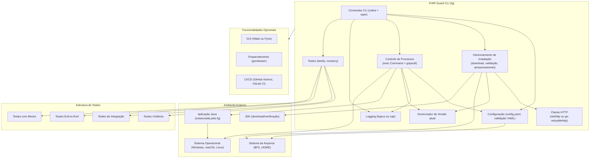

# Configuração do Projeto FHIR Guard CLI (`fg`)

## Escolha da Linguagem
**Go (Golang)** é a linguagem recomendada para este projeto devido a:
- **Compilação cross-platform** (Windows, macOS, Linux)
- **Ferramentas robustas para CLI** (ex: bibliotecas Cobra/Viper)
- **Performance** (compilada, sem dependências de runtime)
- **Suporte a concorrência** (goroutines para tarefas paralelas)

---

## Frameworks e Bibliotecas Necessárias
### Dependências Principais
| Categoria           | Ferramenta/Biblioteca                                                     | Finalidade                                                             |
|---------------------|---------------------------------------------------------------------------|-------------------------------------------------------------------------|
| Framework CLI       | [`cobra`](https://github.com/spf13/cobra) + [`viper`](https://github.com/spf13/viper) | Gerenciamento de comandos/subcomandos, leitura de configurações        |
| Cliente HTTP        | `net/http` nativo ou [`go-retryablehttp`](https://github.com/hashicorp/go-retryablehttp) | Download de versões/dependências, verificação de atualizações          |
| Análise YAML        | [`gopkg.in/yaml.v3`](https://github.com/go-yaml/yaml)                     | Leitura/escrita de arquivos `config.yaml`                              |
| Gerenciamento de Processos | `os/exec` + [`gopsutil`](https://github.com/shirou/gopsutil)          | Iniciar/parar apps Java, monitorar PID/uso de recursos (CPU, memória)  |
| Logging             | [`logrus`](https://github.com/sirupsen/logrus) ou [`zap`](https://go.uber.org/zap) | Registro estruturado com níveis (debug, info, error)                   |
| Testes              | [`testify`](https://github.com/stretchr/testify) + [`mockery`](https://github.com/vektra/mockery) | Testes unitários, simulação de chamadas de SO/rede                     |

### Opcionais/Avançadas
| Categoria           | Ferramenta/Biblioteca                                                     | Finalidade                                                             |
|---------------------|---------------------------------------------------------------------------|-------------------------------------------------------------------------|
| Integração GUI      | [`Wails`](https://wails.io/) (Go + frontend web) ou [`Fyne`](https://fyne.io/) | Construir GUI cross-platform para o comando `fg gui`                   |
| Empacotamento       | [`goreleaser`](https://goreleaser.com/)                                   | Gerar binários específicos por SO (DEB, RPM, etc.)                     |
| CI/CD               | GitHub Actions/GitLab CI                                                  | Testes automatizados, pipelines de release                             |

---
## Diagrama de Componentes



## Etapas de Desenvolvimento

### 1. Configuração do Projeto
```bash
# Inicializar módulo Go
go mod init github.com/fhir-guard/fg

# Instalar dependências
go get github.com/spf13/cobra@latest
go get github.com/spf13/viper@latest
go get github.com/shirou/gopsutil/v3@latest
```

### 2. Estrutura de Comandos (Cobra)
Implementar comandos conforme a documentação:
```go
// Exemplo para `fg start`
var startCmd = &cobra.Command{
  Use:   "start [versão]",
  Short: "Iniciar uma instância do FHIR Guard",
  Args:  cobra.ExactArgs(1),
  Run: func(cmd *cobra.Command, args []string) {
    version := args[0]
    // Lógica para iniciar app Java, validar configuração, rastrear PID
  },
}
```

### 3. Funcionalidades Principais
- **Gerenciamento de Instalação**:
  - Baixar versões/JARs de URLs (paralelizar com goroutines).
  - Validar versionamento semântico (`x.y.z`).
  - Armazenar artefatos em `$FG_HOME/versions/[versão]/`.

- **Controle de Processos**:
  - Usar `exec.Command` para iniciar processos Java com argumentos do `config.yaml`.
  - Rastrear PIDs em arquivo JSON (ex: `$FG_HOME/active_pids.json`).

- **Configuração**:
  - Gerar `config.yaml` padrão no `fg install`.
  - Validar esquema YAML no `fg start`.

- **Rede**:
  - Implementar retentativas/timeouts para downloads HTTP.
  - Cachear metadados (ex: versões `available`) para evitar chamadas redundantes.

### 4. Testes
- Simular chamadas de sistema/rede para testes de `fg install/update`.
- Validar comportamento cross-platform (manipulação de PID no Windows, sinais Unix).

## Testes

### Estrutura de Testes

O projeto inclui várias categorias de testes:

1. **Testes Unitários**: Testam componentes individuais isoladamente
   - Testes para validação de versão
   - Testes para verificação de checksum
   - Testes para comparação de versões
   - Testes de manipulação de PID e processos

2. **Testes de Integração**: Testam a interação entre componentes
   - Testes da execução de comandos completos
   - Testes de download e instalação de versões
   - Testes de início e interrupção de processos

3. **Testes End-to-End**: Testam o fluxo completo de uso
   - Fluxos de usuário simulados (instalação, iniciação, interrupção)
   - Testes com um servidor HTTP mock

4. **Testes com Mocks**: Usam simulações para testar comportamentos difíceis de reproduzir
   - Mocks para downloaders
   - Mocks para gerenciamento de processos
   - Mocks para buscadores de versão

### Executando os testes

O projeto usa o Makefile para simplificar a execução dos testes. Os seguintes comandos estão disponíveis:

```bash
# Executar apenas testes unitários
make test-unit

# Executar testes de integração
make test-integration

# Executar todos os testes
make test-all

# Executar testes e gerar relatório de cobertura
make test-coverage

# Executar testes com detector de race conditions
make test-race

# Verificação completa: linting e testes
make check
```

### Escrevendo novos testes

Ao adicionar novas funcionalidades, siga estas diretrizes para testes:

1. **Testes unitários**: Para cada função não-trivial, adicione um teste unitário no mesmo pacote, com o sufixo `_test.go`.

2. **Use mocks quando apropriado**: Para dependências externas (HTTP, filesystem, processos), use mocks para isolar o comportamento que está sendo testado.

3. **Testes de integração**: Para novos comandos ou fluxos de uso, adicione testes de integração que simulem a execução completa do comando.

4. **Nomeação de testes**:
   - `Test<NomeDaFunção>` para testes unitários
   - `TestIntegration<Funcionalidade>` para testes de integração
   - `TestMock<Funcionalidade>` para testes com mocks

### 5. Empacotamento
- Usar `goreleaser` para construir binários para todos OS/arquiteturas.
- Gerar man pages e scripts de autocompletar shell.

---

## Requisitos Adicionais
### Gerenciamento de Dependências Java
- **JDK**: Baixar/verificar versões especificadas nos metadados do FHIR Guard.
- **Classpath**: Construir argumentos Java a partir de dependências no `config.yaml`.

### Segurança
- Validar certificados TLS durante downloads.
- Criptografar campos sensíveis (ex: tokens de autenticação) no `config.yaml`.

### Performance
- Analisar uso de memória para arquivos YAML grandes.
- Limitar downloads/processos concorrentes com base nos limites do `config.yaml`.

---

## Pré-requisitos
1. **Go 1.20+**: Necessário para módulos e generics.
2. **Git**: Controle de versão.
3. **Make**: Simplificar comandos de build/test (ex: `make release`).
4. **Docker**: Testes cross-platform (opcional).

---

## Próximos Passos
1. Definir esquema de metadados das versões do FHIR Guard (JSON/YAML).
2. Implementar `fg install` e `fg start` como protótipo funcional mínimo.
3. Adicionar hooks de logging/métricas para `fg status` e `fg logs`.
