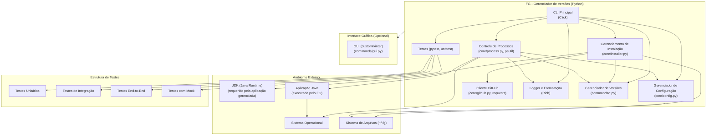

# FG

Ferramenta de **gerenciamento de versões** para uma aplicação Java, oferecida via **CLI** (linha de comando) e **GUI** (interface gráfica). O FG permite listar, instalar, atualizar, iniciar e controlar múltiplas versões da aplicação de forma simples e eficiente.

## Arquitetura Modular

O projeto FG é dividido em cinco módulos independentes, cada um com um propósito específico e um responsável designado:

* **core.cli** – Osmário Filho: componente central da estrutura de linha de comando (CLI); responsável pelo ponto de entrada (*entry point*) e pelo registro dos comandos.
* **version.manager** – Douglas Rocha: gerencia as diferentes versões da aplicação, incluindo download e instalação.
* **runtime.controller** – Mário Ferro: executa e controla as instâncias da aplicação Java, monitorando seu status.
* **config.handler** – Allan Bispo: realiza a leitura e aplicação de configurações a partir de manifestos ou arquivos de configuração.
* **ui.desktop** – Pedro Lucas: interface gráfica baseada em Python (`customtkinter`), permitindo usar o FG via GUI.

## Diagrama de Componentes



## Tecnologias Utilizadas

* [Python](https://www.python.org) – Linguagem principal do projeto.
* [Click](https://click.palletsprojects.com) – Biblioteca Python para construção de CLIs.
* [Rich](https://rich.readthedocs.io) – Biblioteca para formatação e coloração de texto no terminal.
* [psutil](https://pypi.org/project/psutil/) – Informar uso de CPU, memória, processos e sistema.
* [Requests](https://docs.python-requests.org) – Cliente HTTP para acessar repositórios online.
* [CustomTkinter](https://github.com/TomSchimansky/CustomTkinter) – Biblioteca de UI moderna baseada em Tkinter.

## Instalação e Uso

1. Clone o repositório do FG:

   ```bash
   git clone <URL-do-repositório>
   ```
2. Instale as dependências do projeto:

   ```bash
   python -m venv meu_projeto
   meu_projeto\Scripts\activate (windows)
   pip install -r requirements.txt (se der erro de permissão, colocar --user antes do -r)
   ```
3. Torne o script principal executável (opcional em Linux/macOS):

   ```bash
   chmod +x fg.py
   ```
4. Use o FG via linha de comando. Por exemplo:

   * **Listar versões disponíveis:** `python fg.py available`
   * **Listar versões instaladas:** `python fg.py list`
   * **Instalar uma versão específica:** `python fg.py install <versão>`
   * **Atualizar para a versão mais recente:** `python fg.py update`
   * **Mostrar configuração de uma versão:** `python fg.py config <versão>`
   * **Iniciar uma instância da aplicação:** `python fg.py start <versão>`
   * **Verificar status de execução:** `python fg.py status`
   * **Visualizar logs da aplicação:** `python fg.py logs <pid>`
   * **Parar uma instância em execução:** `python fg.py stop <pid>`
   * **Desinstalar uma versão:** `python fg.py uninstall <versão>`
   * **Interface gráfica:** `python fg.py gui`
  5. Testes
  ```bash
    python -m pytest test_fg.py test_core.py test_installer.py -v --cov=. --cov-report=term-missing
  ```

## Comunicação do Time

* **Reuniões:** Discord (planejamento e discussões técnicas).
* **Mensagens rápidas:** WhatsApp (alinhamentos e comunicações diárias).
* **Versionamento:** GitHub.